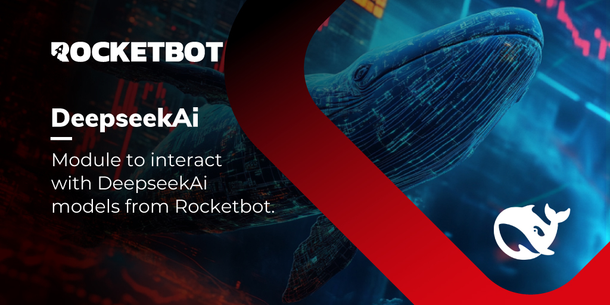

# DeepseekAI
  
Module to interact with DeepseekAI models from Rocketbot.  

*Read this in other languages: [English](Manual_DeepseekAI.md), [Português](Manual_DeepseekAI.pr.md), [Español](Manual_DeepseekAI.es.md)*
  

## How to install this module
  
To install the module in Rocketbot Studio, it can be done in two ways:
1. Manual: __Download__ the .zip file and unzip it in the modules folder. The folder name must be the same as the module and inside it must have the following files and folders: \__init__.py, package.json, docs, example and libs. If you have the application open, refresh your browser to be able to use the new module.
2. Automatic: When entering Rocketbot Studio on the right margin you will find the **Addons** section, select **Install Mods**, search for the desired module and press install.  

## How to use this module

To use this module, we need to obtain a DeepSeek API key and have available credits. Follow these steps:

### Getting the API Key

1. First, create an account or log in at [platform.deepseek.com/api_keys](https://platform.deepseek.com/api_keys).

2. Once on the API keys page, you can generate a new API key.

3. The API key will start with "sk-".

**Important**: Make sure to save the key in a secure place, as you won't be able to see it again after closing this window.

### Purchasing Credits

To use the DeepSeek API, you need to have available credits:

1. Visit the DeepSeek platform and set up your payment method
2. DeepSeek services are paid, make sure you have available balance

**Note**: Without available credits, you won't be able to use the API even if you have a valid API key.

### Using the Module

Once you have your API key and available credits, you can use the module as follows:

1. **Connect to DeepSeek AI**:
   - Use the "Connect to DeepSeek AI" 
command
   - Enter your API key in the corresponding field
   - The module will verify the connection and display available models

2. **Generate Text**:
   - Use the "Generate Text" command
   - Enter your prompt or question
   - Select the model to use. Available models are:
     - `deepseek-chat`: Model optimized for conversations and text generation
     - `deepseek-reasoner`: Model specialized in reasoning and problem solving
   - Configure optional parameters if desired:
     - Temperature (0-1): controls response creativity
     - Max Tokens: response token limit
     - Stop Sequence: text that will stop generation

3. **Query Available Models**:
   - Use the "Get Available Models" command
   - You'll see a list of models you can use with your account

### Recommendations

- Keep your API key secure and don't share it
- Monitor your credit usage regularly
- Use the most appropriate model for your use case:
  - `deepseek-chat`: For general conversational interactions and text 
generation
  - `deepseek-reasoner`: For tasks requiring logical analysis and detailed reasoning
- Adjust temperature based on whether you need more precise (0) or creative (1) responses
- Default temperature value is 1.0
- Default token limit is 2048
## Description of the commands

### Connect to DeepseekAI
  
Establish connection to DeepseekAI
|Parameters|Description|example|
| --- | --- | --- |
|API Key|Your DeepseekAI API key|sk-ant...|
|Assign to variable|Variable name to store the connection|DeepseekAIResult|

### Get Models
  
Retrieve available models from DeepseekAI
|Parameters|Description|example|
| --- | --- | --- |
|Assign to variable|Variable name to store the list of models|modelsResult|

### Generate Text
  
Generate text using DeepseekAI
|Parameters|Description|example|
| --- | --- | --- |
|Prompt|Input text to generate text|What is Rocketbot?|
|Model|ID of the model to use|deepseek-chat|
|Temperature (optional)|Controls the randomness of text generation (0.0 a 2)|0.8|
|Maximum tokens (optional)|Maximum number of tokens to generate|100|
|Stop sequence (optional)|Optional sequence to stop text generation|RPA tool|
|Assign to variable|Variable name to store the generated text|textResult|
